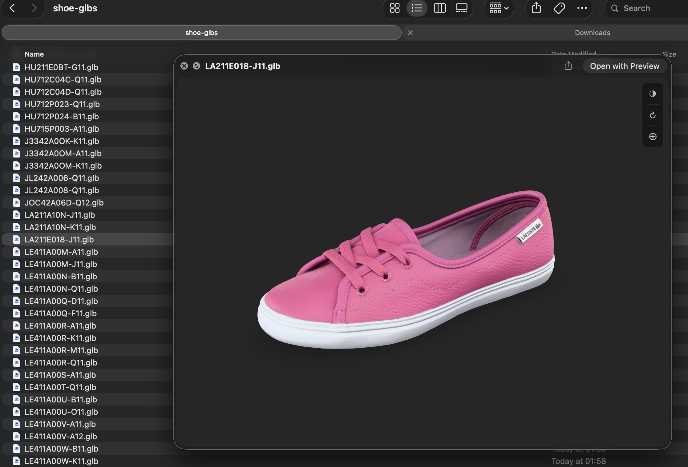
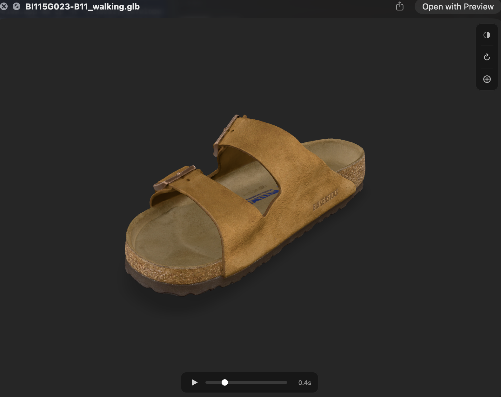
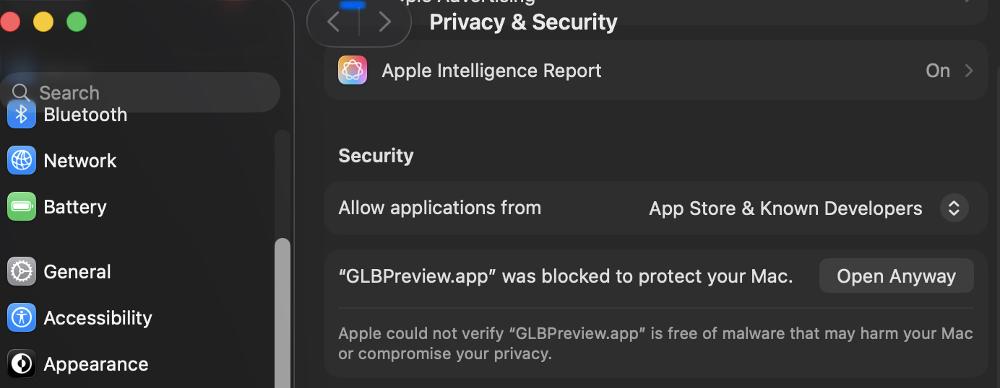

# GLB Quick Look

macOS Quick Look extension for previewing `.glb` (glTF Binary) files. Press spacebar on any `.glb` file in Finder to get an interactive 3D preview with orbit, pan and zoom.




## Features

- Spacebar preview of `.glb` files in Finder
- Interactive 3D viewer (orbit, pan, zoom)
- Draco mesh compression support
- Animation playback with scrubber and pause
- Auto-rotate toggle
- Background colour toggle (dark/mid/light/white)
- Camera reset
- Thumbnail generation for Finder icons
- Fully offline (no network required)

## Install (pre-built)

1. Download [`GLBPreview.zip` from the latest release](https://github.com/DeepARSDK/glb-preview/releases/latest)
2. Unzip and drag `GLBPreview.app` to `/Applications`
3. Right-click the app > **Open**
4. macOS will show a warning that it cannot verify the app. Click **OK**, then go to **System Settings > Privacy & Security** and click **Open Anyway**:



5. The app registers the Quick Look extensions on first launch — you're done

## Requirements

- macOS 13.0+

## Build from source

If you prefer to build from source:

```bash
# Install XcodeGen if you don't have it
brew install xcodegen

# Generate the Xcode project
cd glb-preview
xcodegen generate

# Open in Xcode
open GLBPreview.xcodeproj
```

In Xcode:

1. Select the **GLBPreview** scheme in the toolbar
2. Set your signing team on all three targets (GLBPreview, PreviewExtension, ThumbnailExtension) under **Signing & Capabilities**
3. Build with **Cmd+B**

Then install:

```bash
# Copy to Applications and reset Quick Look
rm -rf /Applications/GLBPreview.app
cp -R ~/Library/Developer/Xcode/DerivedData/GLBPreview-*/Build/Products/Debug/GLBPreview.app /Applications/
qlmanage -r
```

Open the app once to register the extensions:

```bash
open /Applications/GLBPreview.app
```

## Usage

- Select a `.glb` file in Finder and press **Space** to preview
- **Left-drag** to orbit
- **Scroll** to zoom
- Toolbar buttons (top right): background toggle, auto-rotate, camera reset
- Animation controls appear at the bottom when the model has animations

## Set as default app for .glb files

Right-click any `.glb` file > **Get Info** > **Open With** > select **GLBPreview** > **Change All**

## Project structure

```
glb-preview/
├── project.yml                              # XcodeGen project spec
├── GLBPreview/                              # Host app (minimal)
│   ├── GLBPreviewApp.swift
│   └── ContentView.swift
├── PreviewExtension/                        # Quick Look preview (spacebar)
│   ├── PreviewViewController.swift
│   ├── viewer.html                          # model-viewer based 3D viewer
│   └── model-viewer.min.js                  # Bundled model-viewer v4.0.0
└── ThumbnailExtension/                      # Finder icon thumbnails
    └── ThumbnailProvider.swift
```

## TODO

- [ ] Fix ~1s delay on all button interactions in the preview. Likely caused by WKWebView event handling in the sandboxed Quick Look extension. Potential fix: move controls to native AppKit buttons overlaid on the web view.

## Known limitations

- Thumbnail generation does not support Draco-compressed models (shows default icon)
